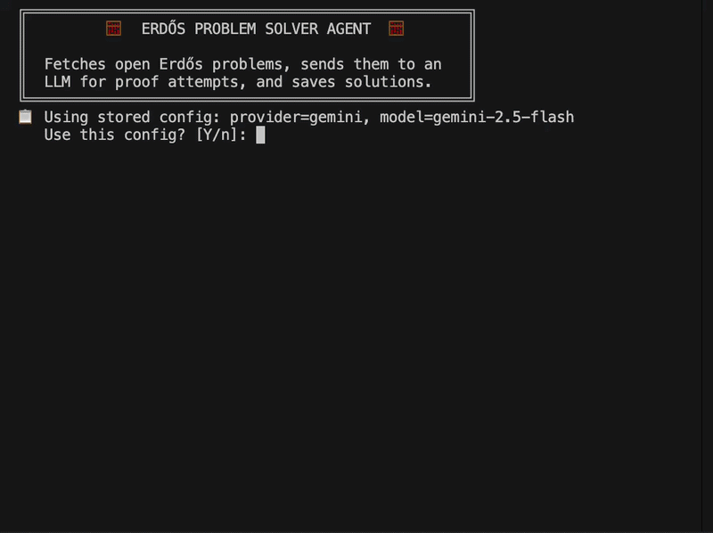

# 🧮 Erdős Problem Solver Agent

A Go-based CLI agent that fetches open Erdős problems from the community database, sends them to an LLM for proof or disproof attempts, and securely saves the generated solutions.

## 📺 Overview



## ✨ Features

- **Automated Scraping**: Fetches the latest open problems from the community database (`problems.yaml`) and scrapes detailed problem descriptions directly from [erdosproblems.com](https://www.erdosproblems.com/).
- **LLM Integration**: Uses the `any-llm` library to interface seamlessly with various LLM providers (OpenAI, Anthropic, Gemini, Groq, Ollama) and orchestrate proof generation.
- **Secure Credentials**: Prompts securely for API keys and stores them via OS keychain encryption for seamless future runs.
- **Continuous Solve Loop**: Allows for selecting and solving multiple problems in a continuous execution loop without needing to restart the CLI.
- **Robust Error Handling**: Retries automatically on transient errors (timeouts, rate limits, network issues) with exponential backoff, and supports long-running LLM requests (up to 120 minutes).
- **Solution Archiving**: Automatically saves generated proofs as markdown files in a designated `solns/` directory.

## 🚀 Getting Started

### Prerequisites

- Go 1.21 or higher installed on your system.

### Build and Run

1. Clone the repository:
   ```bash
   git clone https://github.com/demirbey05/erdos-agent.git
   cd erdos-agent
   ```

2. Build the executable binary:
   ```bash
   go build -o erdos-agent .
   ```

3. Run the agent:
   ```bash
   ./erdos-agent
   ```

## 🛠 Usage & Workflow

1. **Configuration**: On the first run, the agent will prompt you to select an LLM provider (e.g., `openai`, `anthropic`, `gemini`, `groq`, `ollama`), a specific model, and your API key (hidden input). This configuration is securely encrypted and saved to `~/.erdos-agent/config.enc`.
2. **Problem Selection**: The agent retrieves and displays a list of currently open Erdős problems. You can then:
   - Enter a comma-separated list of problem numbers (e.g., `1, 42, 108`).
   - Type `all` to attempt all open problems.
   - Type `prize` to attempt only problems that have an associated cash prize.
3. **Execution**: The agent will automatically fetch the full problem details, query the configured LLM with a specialized prompt to generate an unconditional proof or disproof, and wait for the response.
4. **Results**: Generated solutions are saved in the `solns/` directory. Each markdown file includes the attempt details and is easily readable.

## 🧠 Architecture Overview

The codebase is organized as follows:

- **`main.go`**: The entry point that orchestrates the CLI flow, fetches metadata, and handles the continuous execution loop.
- **`internal/scraper/`**: Retrieves and parses YAML metadata from GitHub and scrapes HTML descriptions from the web.
- **`internal/solver/`**: Interfaces with the LLM via `gollm`, constructs the mathematical prompts, and handles saving the solutions.
- **`internal/keystore/`**: Securely manages API keys using AES-256-GCM encryption.
- **`internal/models/`**: Defines core domain data types like `Problem` and `Status`.

## 🤝 Contributing

Contributions are welcome! Please feel free to submit a Pull Request.
